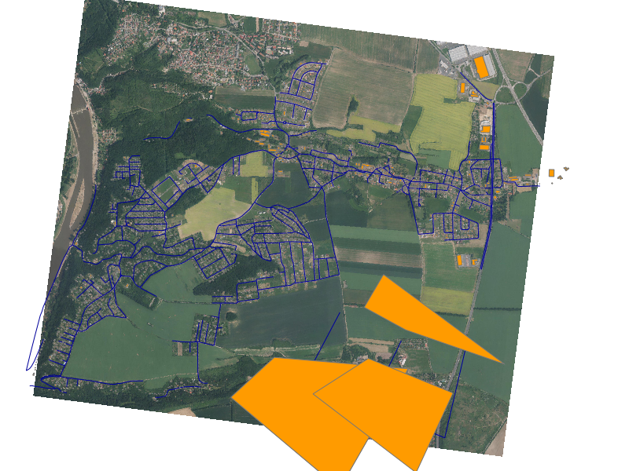

Konfigurace MapServeru
----------------------
MapServer nedisponuje žádným grafickým uživatelským rozhraním. Až na
výjimky [#f1]_ se konfiguruje pomocí jednoduchého textového souboru, který je
velice dobře dokumentován na `na webových stránkách <http://mapserver.org/mapfile/index.html>`_.

Jednotlivé konfigurační sekce jsou započaty klíčovým slovem a ukončeny slovem
``END``. Je lhostejno, používáte-li velká či malá písmena nebo nepoužíváte-li
odsazení jednotlivých sekcí. Pro větší čitelnost se ale doporučuje používate
``VELKÁ PÍSMENA`` v jednolivých sekcích a používat odsazení.

Metadata mapového projektu
^^^^^^^^^^^^^^^^^^^^^^^^^^
Celý příklad *mapfile* si můžete :download:`prohlídnout v souboru <../data/vugtk.map>`. 

Mapfile začíná slovem ``MAP`` a je ukončem zmiňovaným ``END``, v ůvodní sekci
jsou základní údaje o projektu:

.. literalinclude:: ../data/vugtk.map
   :lines: 1-7, 106

Je důležité nakonfigurovat výchozí souřadný systém projektu, použijeme k tomu
EPSG kód pro S-JTSK.

.. literalinclude:: ../data/vugtk.map
   :lines: 25-27

Neméně důležitá jsou metadata pro služby OWS a konfigurační cesty ke vznikajícím obrázkům:

.. literalinclude:: ../data/vugtk.map
   :lines: 12-23

Rastrová vrstva
^^^^^^^^^^^^^^^
Následuje konfigurace vrstev. Jako příklad uvedeme nejprve rastrovou vrstvu z
připraveného lokálně uloženého rastrového souboru.

.. literalinclude:: ../data/vugtk.map
   :lines: 29-40

Všiměte si, že rastrový snímek je v jiném souřadném systému, než celý projekt
(UTM vs. S-JTSK).

OWS Proxy
^^^^^^^^^
MapServer může sloužit také jako proxy pro další služby OGC OWS a kombinovat tak
data z různých zdrojů do jednoho obrázku. To lze také využít, chceme-li
rasterizovat externí datový zdroj např. WFS nebo potřebujeme-li přidat podporu
pro souř.  systémy, které zdrojový server nepodporuje. 

V příkladu níže zobrazíme vrstvnice z WMS serveru ČUZK

.. literalinclude:: ../data/vugtk.map
   :lines: 42-56

Vektorová vrstva
^^^^^^^^^^^^^^^^
MapServer podporuje všechny myslitelné vektorové formáty (díky knihovně
GDAL/OGR). V našem příkladu se připojíme na dříve vytvořenou databázi PostGIS a
zobrazíme v ní vrstvu ``stavebniobjekty`` pod názvem ``budovy``. Všimněte si
sekcte ``METADATA``, ve které nastavíme některé atributy budoucích webových
služeb (WMS, WFS).
   
.. literalinclude:: ../data/vugtk.map
   :lines: 82-104

.. _konfigurace-sluzby:

Nastavení webové služby
^^^^^^^^^^^^^^^^^^^^^^^
Program ``mapserver(.exe)`` rozpoznává parametr ``map`` v URL, který odkazuje na
daný mapový soubor, např::

    http://localhost/cgi-bin/mapserver.exe?map=c:\data\skoleni\vugtk.map

Lepší možnost je, *exportovat* proměnnou prostředí ``MS_MAPFILE``, což můžeme
buď v nastavení webového server [#f2]_ ::

    Alias /mywms /usr/lib/cgi-bin/mapserver
    <Location /mywms>
       SetHandler cgi-script
       Options ExecCGI
       SetEnv MS_MAPFILE /path/to/mymapfile.map
    </Location>

nebo zkopírovat `mapserv.exe` pod novým jménem a toto jméno použít::

    SetEnvIf Request_URI "/cgi-bin/vugtkwms" MS_MAPFILE=/path/to/mymap.map

Testování konfigurace mapserveru
^^^^^^^^^^^^^^^^^^^^^^^^^^^^^^^^
První možností je testova konfiguraci pomocí programu ``shp2img``, který vezme
výchozí nastavení v námi vytvořeném konfiguračním mapfile a vyrobí z něj
obrázek

.. admonition:: Testování mapového souboru v příkazové řádce
   :class: cmd

    $ shp2img --help
    [...]
    $ shp2img -m vugtk.map -o vugtk.png

   Výsledek programu ``shp2img``

Testování WMS
^^^^^^^^^^^^^
Do webového prohlížeče můžeme nyní zadat adresu WMS s dotazem
``GetCapabilities`` pro metadata služby WMS. 

.. note:: Předpokládáme, že máme nakonfigurovanou adresu služby
    http://localhost/cgi-bin/vugtkwms, viz výše :ref:`konfigurace-sluzby`

http://localhost/cgi-bin/vugtkwms?service=wms&request=getcapabilities

Odpověď ze serveru by měla následovat::

    <?xml version='1.0' encoding="ISO-8859-1" standalone="no" ?>
    <WMS_Capabilities version="1.3.0"  xmlns="http://www.opengis.net/wms"   xmlns:sld="http://www.opengis.net/sld"   xmlns:xsi="http://www.w3.org/2001/XMLSchema-instance"   xmlns:ms...
    [...]
      </Layer>
    </Capability>
    </WMS_Capabilities>

Následovat může připojení služby WMS do programu QGIS, viz :ref:`my-reference-label`.

.. rubric:: :secnotoc:`Poznámky`

.. [#f1] MapServer lze využít ve vlastích programech díky API, potom je
  konfigurace vyřešena přímo v programu a ne v externím konfiguračním souboru.

.. [#f2] Nastavení proměnných prostředí pro MapServer http://mapserver.org/ogc/wms_server.html
