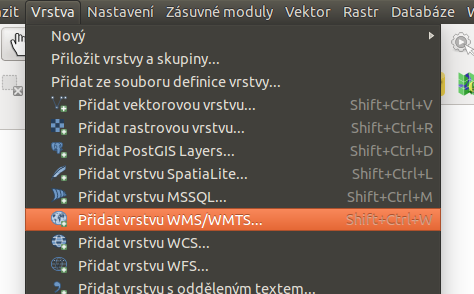
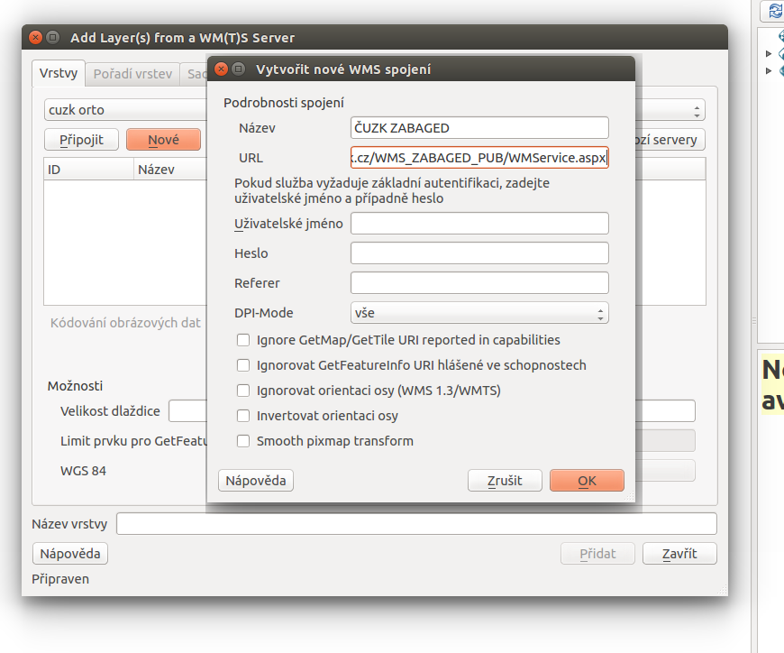
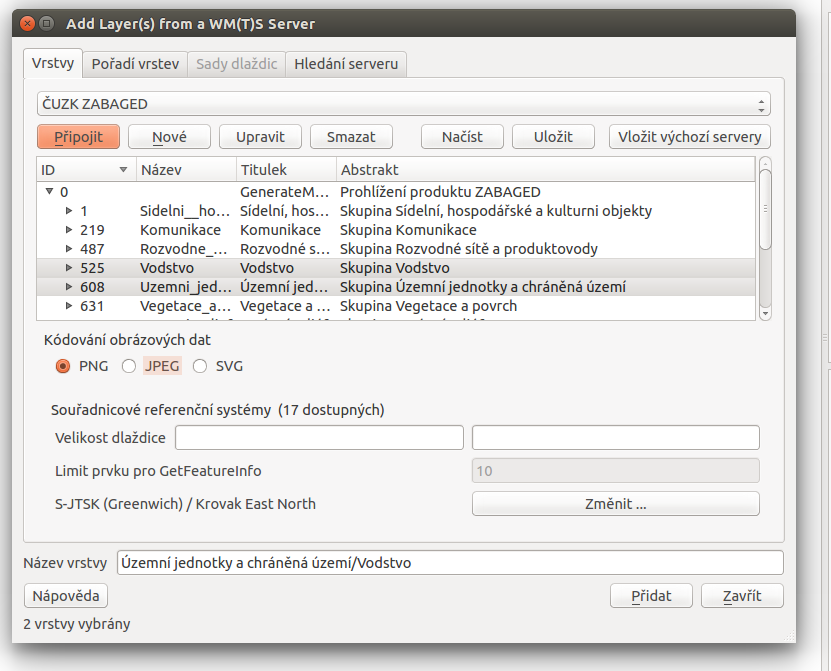
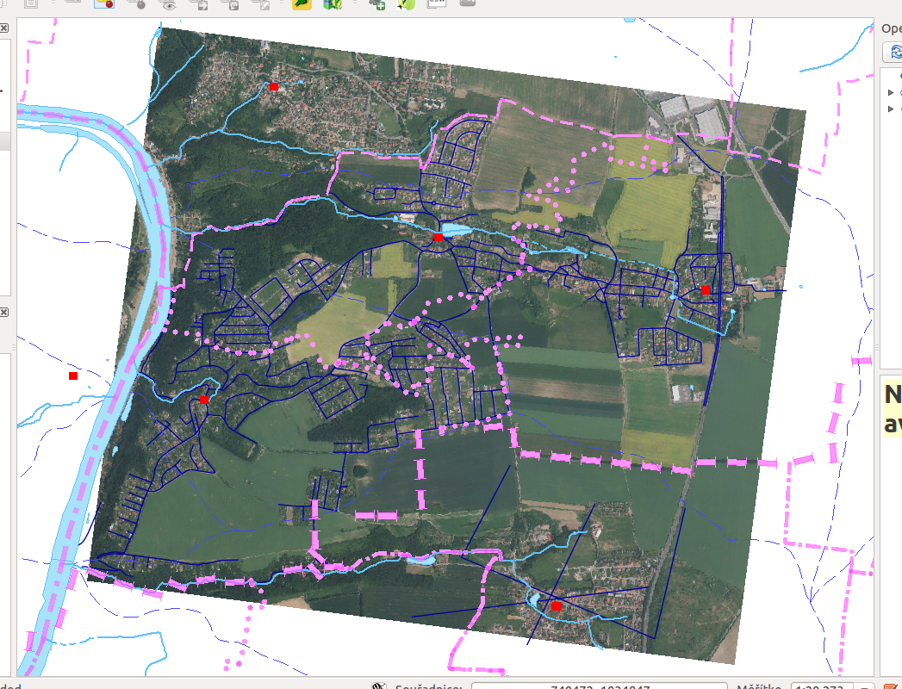
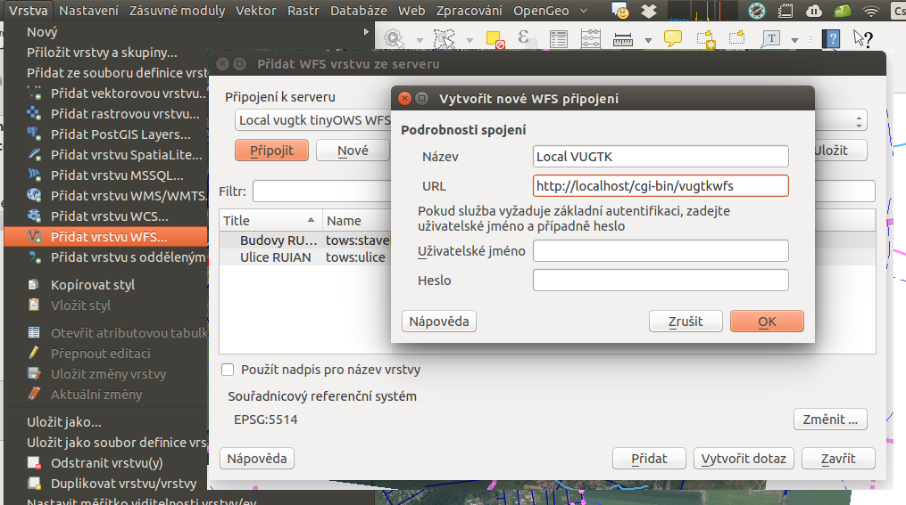
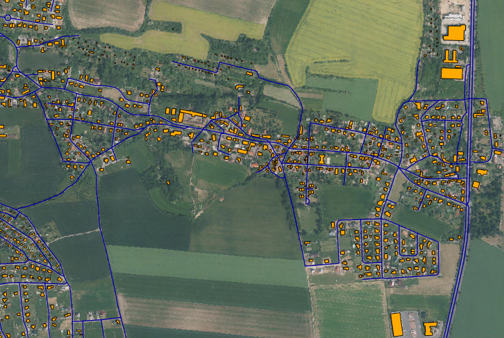
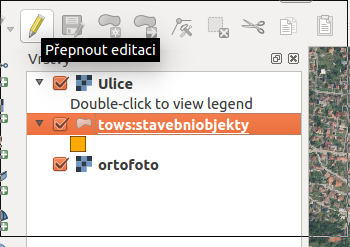
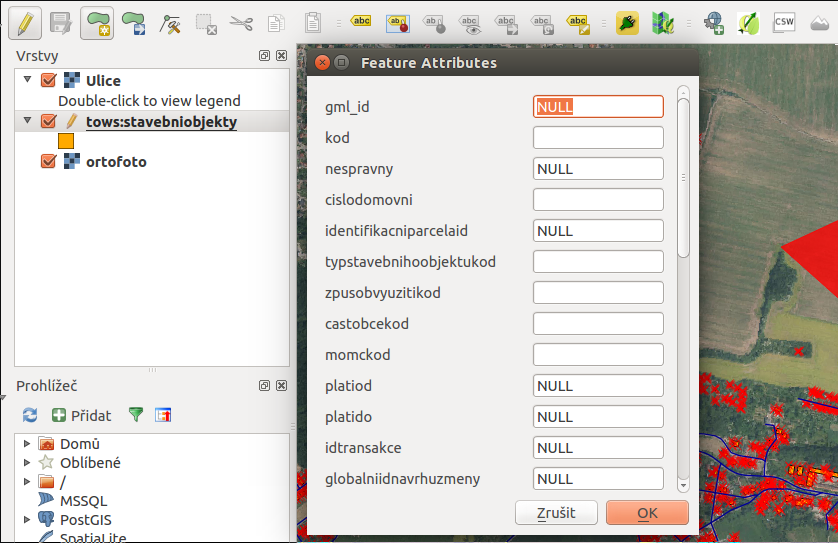
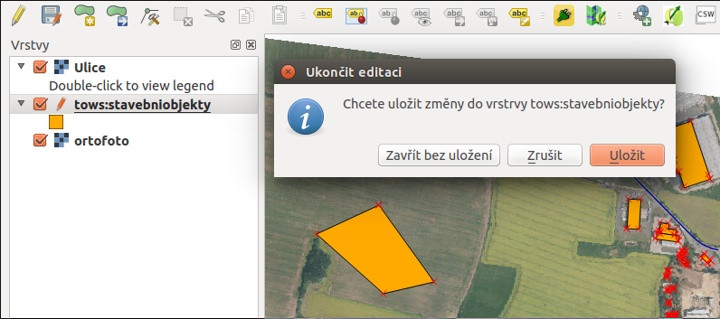

.. _my-reference-label:

Zobrazení WMS a WFS vrstev v QGISu
==================================

Program QGIS obsahuje nástroje pro připojení a práci s externími datovými zdroji
pomocí služeb `OGC OWS <http://opengeospatial.org/standards/>`_.

Připojení vzdálené WMS
-----------------------
V *menu* :menuselection:`Vrstva --> Přidat vrstvu WMS/WMTS` spustíme nástroj pro
přidávání služeb OGC WMS a WMTS.

Jako první krok musíme přidat adresu WMS serveru, ze kterého chceme načíst
vrstvy. Zadejme server `ČUZK ZABAGED <http://geoportal.cuzk.cz/(S(h5zf1imhatnjn05loejijgrx))/Default.aspx?mode=TextMeta&side=wms.verejne&metadataID=CZ-CUZK-WMS-ZABAGED-P&metadataXSL=metadata.sluzba&head_tab=sekce-03-gp&menu=3113>`_ http://geoportal.cuzk.cz/WMS_ZABAGED_PUB/WMService.aspx

Nyní se již můžeme připojit na službu ČUZK a vybrat si vrstvy, které chceme
zobrazit:

V obrázku je patrno, že:

    * jsme vybrali dvě vrsrtvy (Vodstvo a Územní jednotky)
    * a změnili jsme souř. systém z přednastaveného WGS 84 na S-JTSK (EPSDG:5514)

Po přidání nové vrstvy do mapy (WMS server pro nás sloučí obě vrstvy do jednoho
obrázku):

.. figure:: ../qgis/qgis-wms-zabaged.png

Na obrázku jsou data zobrazena na dříve přidaném pokladu ortofoto.

Připojení lokální WMS
---------------------

Postupujeme stejným způsobem, přidáme server s url 

    http://localhost/cgi-bin/vugtkwms

A zobrazit můžeme například vrstvu ulic.

    Obrázek obsahuje pokladové ortofoto z lokálního souboru, Vodstvo a
    Územní jednotky z WMS služby ČUZK a uliční síť (data z RUAIN) z námi
    nakonfigurované lokální WMS

Připojení lokální WFS
---------------------
Podobně jako jsme přidali lokální server WMS můžeme přidat lokální WFS (z
TinyOWS, viz kapitola :ref:`tinyows`), adresa serveru je 

    http://localhost/cgi-bin/vugtkwfs

A můžeme přidat vrstvu ``budovy`` (v souř. systému S-JTSK):

    
    Na obrázku je podkladová mapa z lokálního souboru, uliční síť z naší služby
    WMS a stavební objekty RUAIN, publikované naším TinyOWS WFS serverem.

Editace dat pomocí protokolu WFS
--------------------------------
Stejně jako u editace vektorových vrstev z lokálně uloženého souboru nebo z
připojené databáze (PostGIS, SpatiaLite, ...), můžeme editovat vrstvu připojenou
pomocí protokolu WFS-T.

Po zakreslení nového prvku (polygonu) a ukončení editace *Pravým tlačítkem
myši*, se objeví formulář pro vyplnění atributů. Po jeho odeslání je prvek
uložen lokálně.

Aby byly změny promítnuty na server, je potřeba ukončit editaci.

Pokud se neobjeví žádná chybová hláška, byly všechny prvky uloženy
prostřednictvím protokolu OGC WFS-T do databáze PostGIS.
