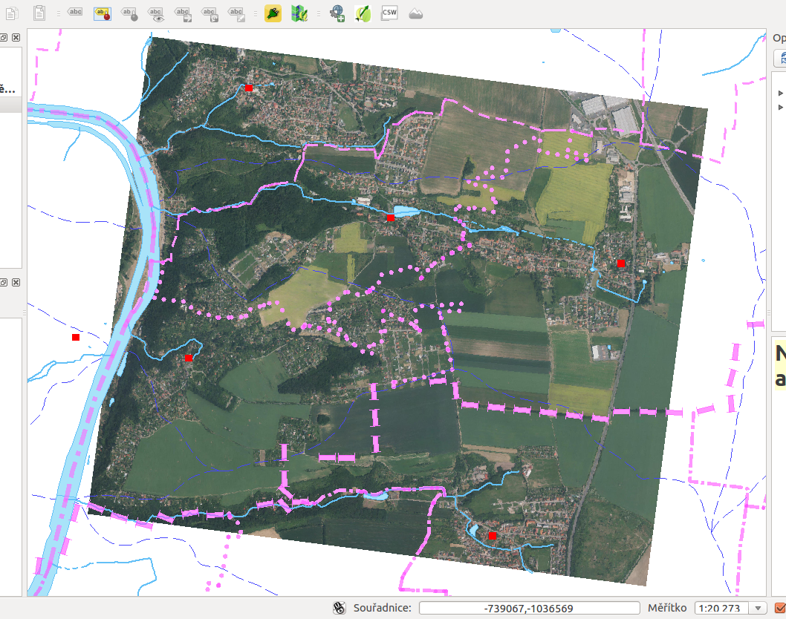

.. _my-reference-label:

Zobrazení WMS a WFS vrstev v QGISu
==================================

Program :doc:`QGIS <../qgis/index>` obsahuje nástroje pro připojení a práci s externími datovými zdroji
pomocí služeb `OGC OWS <http://opengeospatial.org/standards/>`_.

Připojení vzdálené WMS
-----------------------
V *menu* :menuselection:`Vrstva --> Přidat vrstvu WMS/WMTS` spustíme nástroj pro
přidávání služeb OGC :wikipedia:`WMS` a :wikipedia-en:`WMTS`.

.. figure:: ../qgis/qgis-wms-wmts-menu.png

Jako první krok musíme přidat nové WMS spojení a do pole URL zadat adresu WMS serveru, ze kterého chceme načíst
vrstvy. Použijeme server `ČÚZK ZABAGED <http://geoportal.cuzk.cz/(S(h5zf1imhatnjn05loejijgrx))/Default.aspx?mode=TextMeta&side=wms.verejne&metadataID=CZ-CUZK-WMS-ZABAGED-P&metadataXSL=metadata.sluzba&head_tab=sekce-03-gp&menu=3113>`_  - http://geoportal.cuzk.cz/WMS_ZABAGED_PUB/WMService.aspx

.. figure:: ../qgis/qgis-add-wms-server.png

Nyní se již můžeme připojit na službu ČÚZK a vybrat si vrstvy, které chceme
zobrazit:

.. figure:: ../qgis/qgis-wms-layer-selection.png

Z obrázku je patrno, že:

    * jsme vybrali dvě vrstvy (Vodstvo a Územní jednotky)
    * a změnili jsme souřadnicový systém z přednastaveného WGS 84 na S-JTSK (:epsg:`5514`)

Po potvrzení jsou vybrané vrstvy přidány do mapy - WMS server je automaticky sloučí do jednoho
obrázku:

    Na obrázku jsou data zobrazena na dříve přidaném pokladu ortofoto.

Připojení lokální WMS
---------------------

Postupujeme stejným způsobem, tentokrát však přidáme server s URL 

    http://localhost/cgi-bin/vugtkwms

A vybereme například vrstvu :map:`ulice` (v souřadnicovém systému S-JTSK :epsg:`5514`).

.. figure:: ../qgis/qgis-wms-zabaged-local.png

    Obrázek obsahuje podkladové ortofoto z lokálního souboru, Vodstvo a
    Územní jednotky z WMS služby ČÚZK a uliční síť (data z RÚIAN) z námi
    nakonfigurované lokální WMS.

Připojení lokální WFS
---------------------
Podobně jako jsme přidali lokální server WMS, můžeme přidat i lokální WFS (viz kapitola :doc:`tinyows`). Adresa serveru je 

    http://localhost/cgi-bin/vugtkwfs

.. figure:: ../qgis/qgis-wfs-server.png

A vybereme například vrstvu :map:`budovy` (v souřadnicovém systému S-JTSK :epsg:`5514`).

    Na obrázku je podkladová ortofotomapa z lokálního souboru, uliční síť z naší služby
    WMS a stavební objekty RÚIAN publikované naším TinyOWS WFS serverem.

Editace dat pomocí protokolu WFS
--------------------------------
Stejně jako u :doc:`editace <../qgis/editace>` vektorových vrstev z lokálně uloženého souboru nebo z
připojené databáze (:doc:`PostGIS <../postgis/index>`, SpatiaLite, ...), můžeme editovat vrstvu připojenou
pomocí protokolu *WFS-T*.

Po zakreslení nového prvku (polygonu) se objeví formulář pro vyplnění atributů. Po jeho odeslání je prvek
uložen lokálně.

Aby byly změny promítnuty na server, je potřeba ukončit editaci.

.. figure:: ../qgis/qgis-wfs-save-database.png

Pokud se neobjeví žádná chybová zpráva, byly všechny změny úspěšně uloženy
prostřednictvím protokolu OGC WFS-T do geodatabáze :doc:`../postgis/index`.
