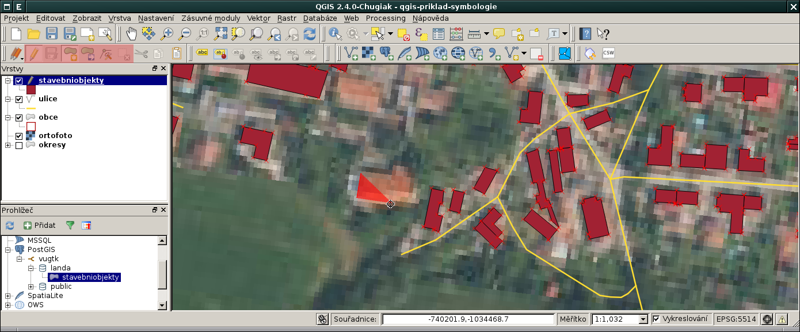

Editace dat z geodatabáze PostGIS v QGISu
=========================================

Editace vektorových dat uložených v geodatabázi PostGIS probíhá
naprosto standardně jako pro jiné datové formáty, viz :doc:`návod
<../qgis/editace>`.

