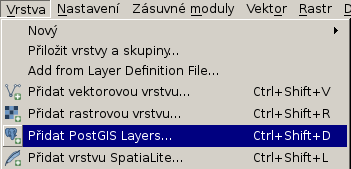
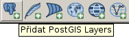
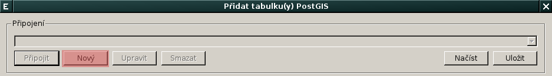
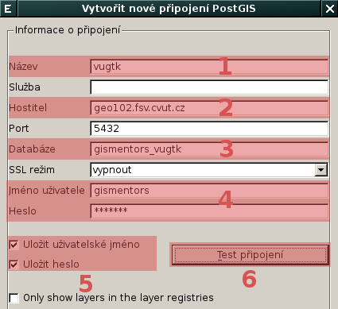
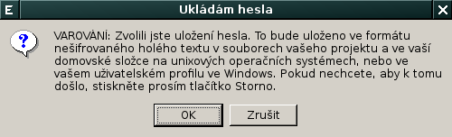
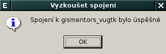
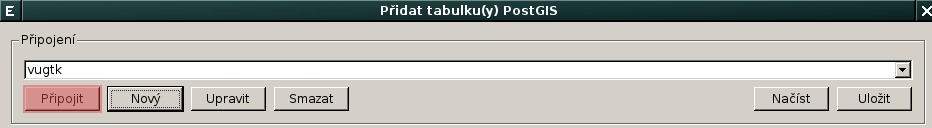
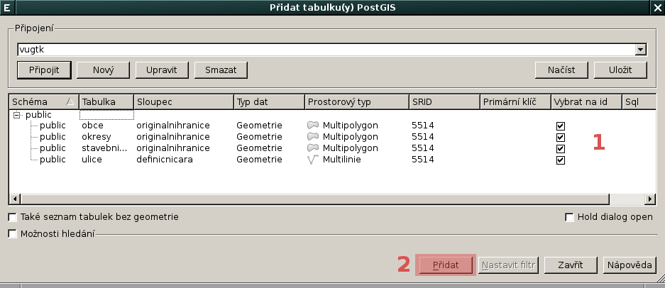
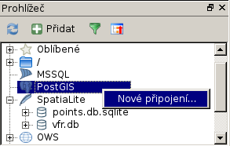
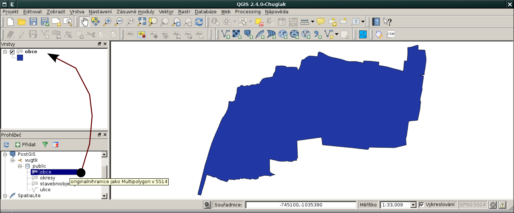

Zobrazení dat z geodatabáze PostGIS v QGISu
===========================================

Vektorová data uložená v geodatabázi PostGIS je možné načíst z *menu*

anebo z *nástrojové lišty* aplikace QGIS.

V dialogu nejprve definuje parametry připojení k databázi.

Nastavíme:

* název spojení :fignote:`(1)`
* hostilel (adresa serveru, pokud je to localhost nemusíme vyplňovat) :fignote:`(2)`w
* databáze, ke které se chceme připojit :fignote:`(3)`
* uživatelské jméno a heslo pro připojení k DB :fignote:`(4)`

Při opětovném připojení je vhodné si uživatelské jméno a popřípadě i
heslo (v tomto případě bude ale heslo uloženo na lokálním disku v
textovém souboru!) zapamatovat :fignote:`(5)`

Nastavení připojení k databázi nejprve otestujeme :fignote:`(6)` a
poté potvrdíme.

Poté se můžeme již k databázi připojit

a vybrat vektorové vrstvy :fignote:`(1)`, které chceme z geodatabáze
načíst :fignote:`(2)`.

Alternativní postup (datový katalog)
^^^^^^^^^^^^^^^^^^^^^^^^^^^^^^^^^^^^

Připojení k databázi PostGIS je možné definovat i v rámci *datového
katalogu (prohlížeči)*.

Vektorovou vrstvu z geodatabáze PostGIS přetáhneme z datového katalogu
do okna *Vrstvy*.

