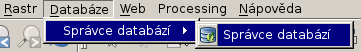
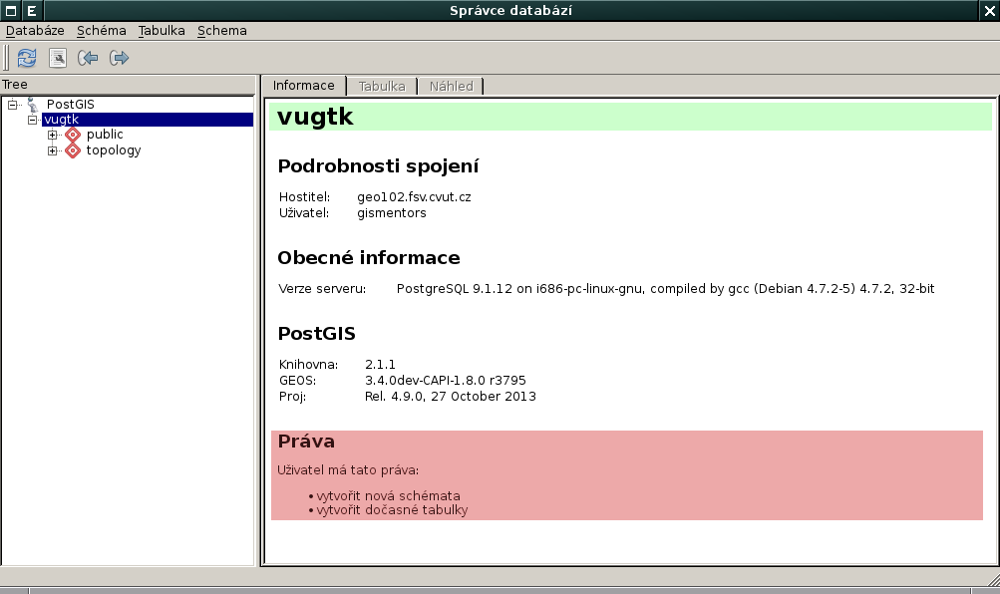
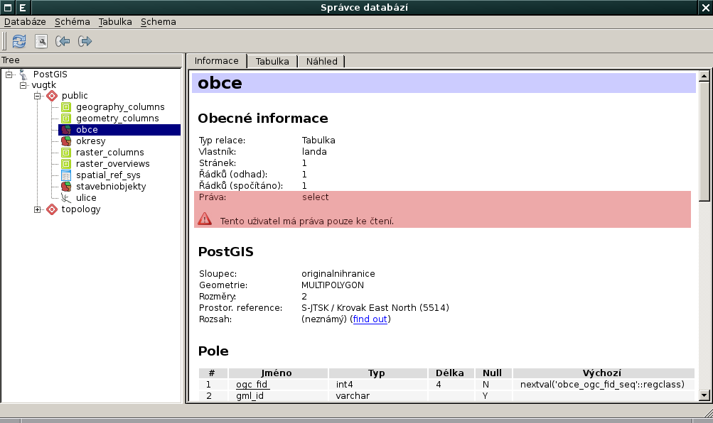
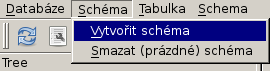
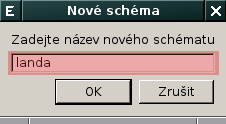
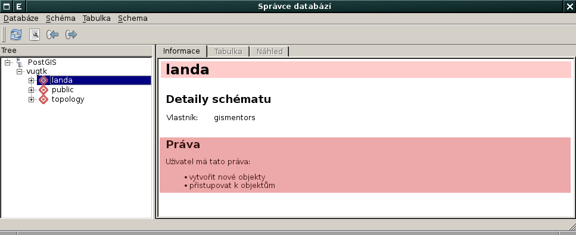

Nahrání vektorových dat do geodatabáze PostGIS
----------------------------------------------

V této části workshopu si ukážeme postup nahrání vektorových dat ve
formátu :wikipedia:`Esri Shapefile` do geodatabáze :doc:`index`.

Postup pro QGIS
===============

Nahrání vektorových dat do geodatabáze PostGIS umožňuje v QGISu
zásuvný modul **DB Manager**. Tento zásuvný modul je součástí
instalace, je potřeba ho pouze povolit.

.. figure:: qgis-db-manager.png

DB Manager spustíme z menu aplikace QGIS.

V dialogu vybereme cílovou databázi, v tomto případě, předpokládáme,
že již máme definováno v QGISu parametry připojení k databázi, viz
:doc:`návod <qgis>`.

            Uživatel ``gismentors`` má právo v databázi vytvářet vlastní schémeta.

Můžeme procházet metadata jednotlivých vrstev uložených v geodatabázi.

            Uživatel ``gismentors`` má pro vrstvu :map:`obce` ve
            schématu *public* pouze právo čtení, data nemůže
            modifikovat.

V našem případě uložíme vlastní vektorová data do *vlastního schématu*,
nejprve toto schéma vytvoříme.

            V nově vytvořem schéma již má uživatel ``gismentors`` má právo zápisu.

Další možnosti
==============

pgAdmin3
^^^^^^^^

shp2pgsql
^^^^^^^^^

ogr2ogr
^^^^^^^
