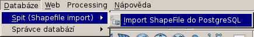
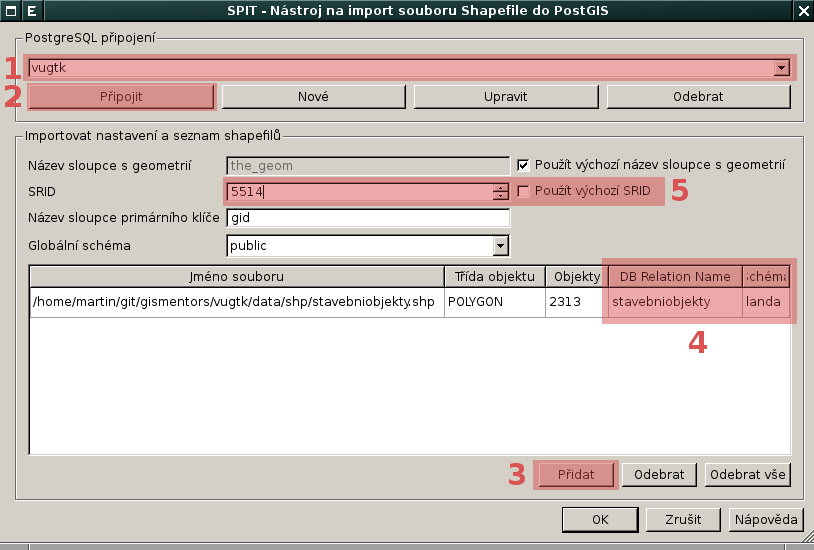
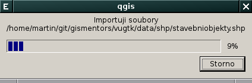
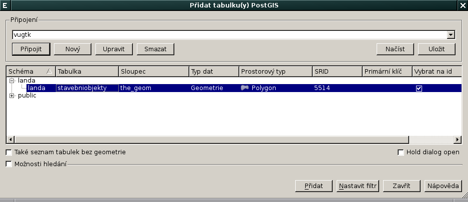
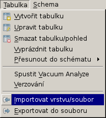
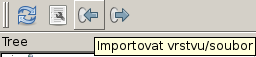
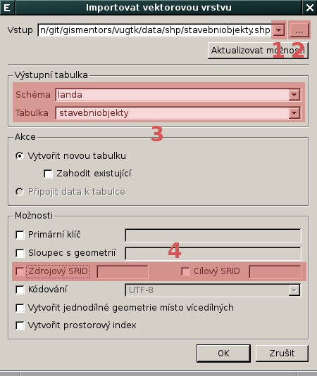
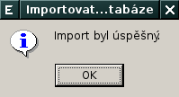

Nahrání vektorových dat do geodatabáze PostGIS
----------------------------------------------

V této části workshopu si ukážeme postup nahrání vektorových dat ve
formátu :wikipedia:`Esri Shapefile` do geodatabáze :doc:`index`.

Postup pro QGIS
===============

Workshop je koncipován tak, že každý uživatel pracuje ve vlastní
databázovém schématu. Toto schéma vytvoříme pomocí zásuvného modulu
**DB Manager**. Tento zásuvný modul je součástí základní instalace a
je dostupný automaticky.

Vytvoření databázového schématu
^^^^^^^^^^^^^^^^^^^^^^^^^^^^^^^

DB Manager spustíme z menu aplikace QGIS.

.. figure:: qgis-db-manager-menu.png
            :width: 350px

V dialogu vybereme cílovou databázi [#f1]_.

.. figure:: qgis-db-manager-priv.png
            :width: 700px

            Uživatel ``gismentors`` má právo v databázi vytvářet vlastní schémeta.

Můžeme procházet metadata jednotlivých vrstev uložených v geodatabázi.

.. figure:: qgis-db-manager-layer.png
            :width: 700px

            Uživatel ``gismentors`` má pro vrstvu :map:`obce` ve
            schématu *public* pouze právo čtení, data nemůže
            modifikovat.

V našem případě uložíme vlastní vektorová data do *vlastního schématu*,
nejprve toto schéma vytvoříme.

.. figure:: qgis-db-manager-new-schema.png
            :width: 300px

.. figure:: qgis-db-manager-create-schema.png
            :width: 225px

.. figure:: qgis-db-manager-new-schema-prop.png
            :width: 700px

            V nově vytvořem schéma již má uživatel ``gismentors`` má právo zápisu.

Import Esri Shapefile do PostGISu
^^^^^^^^^^^^^^^^^^^^^^^^^^^^^^^^^

Import vektorových dat ve formátu Esri Shapefile umožňuje zásuvný
modul **Spit (Shapefile import)** dostupný z menu.

V dialogu zvolíme databázi :fignote:`(1)` [#f1]_, ke které se
připojíme :fignote:`(2)`. Přidáme soubor ve formátu Esri Shapefile
:fignote:`(3)` určený k importu, definujeme název pro výstuplní
databázovou tabulku a schéma :fignote:`(4)`. Jako poslední určíme kód
souřadnicového systému (v tomto případě :wikipedia:`EPSG`) vektorových
dat :fignote:`(5)`.

Naimportovaná vrstva z geodatabáze PostGIS se nezobrazí automaticky,
musíme ji :doc:`přidat manualně <qgis>`.

Další možnosti
==============

DB Manager
^^^^^^^^^^

Nahrání dat ve formátu Esri Shapefile do geodatabáze PostGIS umožňuje
v QGISu i zásuvný modul **DB Manager**. Soubor ve formátu Esri
Shapefile naimportujeme z menu

anebo z nástrojé lišty.

V dialogu můžeme vybrat pro import do geodatabáze buď již načtenou
vektorovou vrstvu :fignote:`(1)` anebo vybrat soubor ve formátu Esri
Shapefile z disku :fignote:`(2)`. Dále můžeme změnit cílové schéma a
název výsledné tabulky v databázi :fignote:`(3)`. Dialog nabízí další
možnosti včetně transformace do jiného souřadnicového systému
:fignote:`(4)`.

pgAdmin3
^^^^^^^^

.. todo::

shp2pgsql
^^^^^^^^^

.. todo::

ogr2ogr
^^^^^^^

.. todo::

.. rubric:: :secnotoc:`Poznámky`

.. [#f1] Předpokládáme, že již máme definovány v QGISu parametry
         připojení k databázi, viz :doc:`návod <qgis>`.
