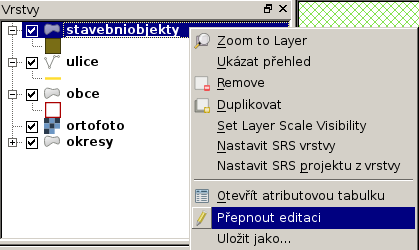
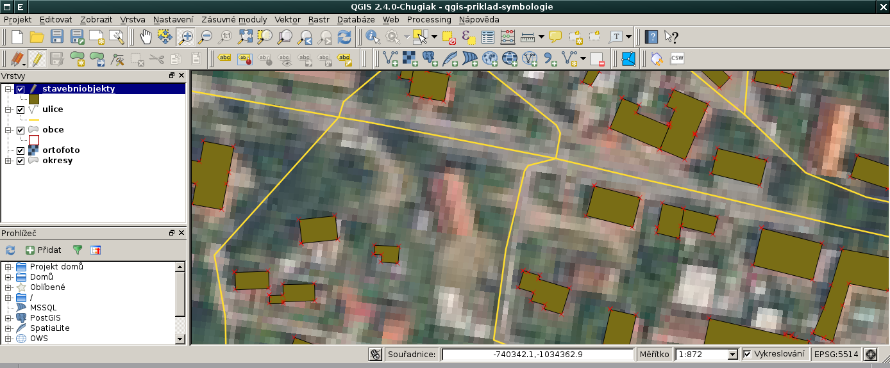
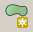
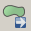
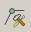
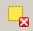
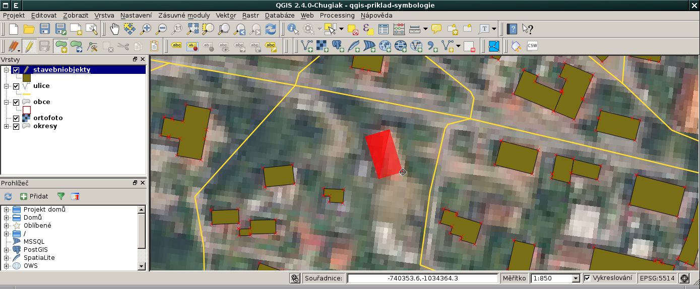
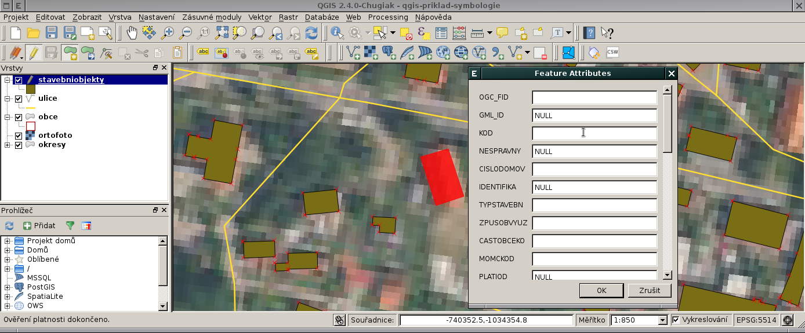

Editace vektorových dat
-----------------------

QGIS umožňuje editaci [#f1]_ různých formátů vektorových dat včetně formátu
:wikipedia:`Esri Shapefile`.

.. admonition:: Poznámka pro experty
        
       O možnosti editace vektorových dat v QGISu rozhoduje to, zda
       datový provider příslušného formátu tuto možnost podporuje. V
       případě formátu Esri Shapefile jsou data načítána datovým
       providerem knihovny `GDAL <http://gdal.org>`_, který modifikaci
       dat v tomto formátu podporuje.

Přepnout danou vektorovou vrstvu do *editačního módu* je možné z
kontextového menu

anebo *nástrojové lišty* QGISu.

Po přepnutí do editačního módu se vrstva zobrazí včetně lomových bodů
(červené křížky).

**Editační nástorová lišta** QGISu umožňuje

.. table::
   :class: toc

   +-----+-------------------------------------------------+
   | |A| |  přídávat nové prvky                            |
   +-----+-------------------------------------------------+
   | |M| |  přesunovat existující prvky                    |
   +-----+-------------------------------------------------+
   | |N| |  modifikovat uzly (přídávat, mazat a přesunovat)|
   +-----+-------------------------------------------------+
   | |D| |  smazat vybrané prvky                           |
   +-----+-------------------------------------------------+
   | |C| |  vyjmout vybrané prvky                          |
   +-----+-------------------------------------------------+
   | |O| |  kopírovat vybrané prvky                        |
   +-----+-------------------------------------------------+
   | |P| |  vložit prvky                                   |
   +-----+-------------------------------------------------+

.. |C| image:: qgis-edit-cut.png
               :width: 32px
               :align: middle

.. |P| image:: qgis-edit-paste.png
               :width: 32px
               :align: middle

Příklad přidání nového prvku
============================

Z nástrojové lišty vybereme nástroj pro přidávání nových prvků |A|.

Lomové body volíme stisknutím levého tlačítka myši. Poslední zvolený
lomový bod můžeme vrátit zpět pomocí klávesy ``Backspace``.

Editaci prvku ukončíme stisknutím pravého tlačítka myši. V posledním
kroku můžeme vyplnit atributy nově přidaného prvku.

.. rubric:: :secnotoc:`Poznámky`

.. [#f1] http://docs.qgis.org/2.2/en/docs/user_manual/working_with_vector/editing_geometry_attributes.html 
