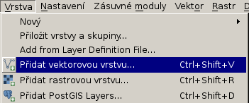
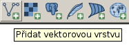
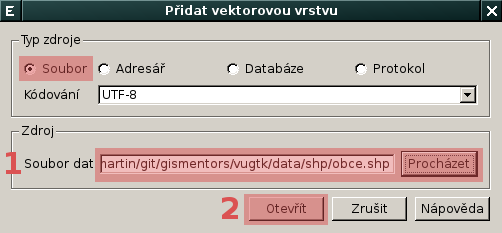
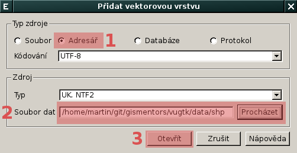

QGIS
====

`QGIS <http://qgis.org>`_ (dříve označovaný také jako *Quantum GIS*)
je desktopový open source nástroj určený pro zobrazování, manipulaci a
analýzu geografických dat (viz :wikipedia:`wikipedia <QGIS>`). QGIS patří ve své
oblasti mezi nejrozšířenější aplikace a to především díky své
uživatelské přívětivosti. QGIS funguje na nejrozšířenějších
platformách :wikipedia:`MS Windows`, :wikipedia:`Mac OSX` a :wikipedia:`GNU/Linux`.

.. todo:: rozšířit uvodní odstavec

.. note:: Návod je koncipován pro verzi **QGIS 2.4**
.. image:: qgis-version.png

Načtení vektorových dat ve formátu Esri Shapefile
-------------------------------------------------

Vektorová data (v našem případě data ve formátu :wikipedia:`Esri
Shapefile`) je možné načíst z *menu*

anebo z *nástrojové lišty* aplikace QGIS.

V dialogu pro přidání vektorové vrstvy vybereme *soubor*
:fignote:`(1)`, který chceme přidat do QGISu jako novou vektorovou
vrstvu.

            Přidání souboru `obce.shp` jako nové vektorové vrstvy

QGIS umožňuje přidat více vrstev najednou, tj. více souborů z daného
adresáře. V dialogu pro přidání vektorové vrstvy zvolíme *typ zdroje:
adresář* :fignote:`(1)` a poté zvolíme *adresář* :fignote:`(2)`, ze
kterého chceme soubory načíst.

            Načtení více souborů z daného adresáře

Posléze se objeví dialog, který umožňuje vybrat jaké vektorové vrstvy
chceme do QGISu načíst, v našem případě vybereme všechny
:fignote:`(1)` vrtsvy kromě *obce* (kterou jsme přidali již dříve).

.. figure:: qgis-load-shapefile-dir-select.png

            Výběr vektorových vrstev k načtení do QGISu

Uložení vektorových dat do geodatabáze PostGIS
----------------------------------------------

Editace vektorových dat
-----------------------

