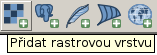

Načtení rastrových dat ve formátu JPG a nastavení souřadnicového systému
------------------------------------------------------------------------

.. note:: Rastrová data ve formátu :wikipedia-en:`JPEG` jsou
          umístěna v adresáři ``data/raster`` `zip archivu
          <https://github.com/GISMentors/vugtk/archive/master.zip>`_
          workshopu.

Rastrová data (v našem případě data ortofoto ve formátu JPEG) je
možné načíst z *menu*

anebo z *nástrojové lišty* aplikace QGIS.

Nakonec zvolíme soubor, který chceme načíst do QGISu jako novou rastrovou vrstvu.

.. figure:: qgis-load-jpg-select.png

Data obsahují přidružený soubor ve formátu :wikipedia-en:`World file` (``jgw``). QGIS tedy zobrazí jako georeferencovaná, nicméně chybí informace o souřadnicovém systému. Pokud není nastaveno jinak, tak QGIS předpokládá WGS-84 (:epsg:`4326`), viz obr. níže.

Vzhledem k tomu, že jsou data lokalizována v souřadnicovém systému UTM
33N (:epsg:`32633`), je potřeba nastavení rastrové vrtsvy v QGISu
změnit.

V záložce dialogu *Obecné* v sekci *Souřadnicový referenční systém* přiřadíme rastrové vrstvě korektní informaci o souřadnicovém připojení.

.. figure:: qgis-raster-properties-srs.png
            :width: 800px

V tomto dialogu vybereme souřadnicový systém UTM 33N.

.. figure:: qgis-raster-properties-srs-dialog.png
            :width: 600px

