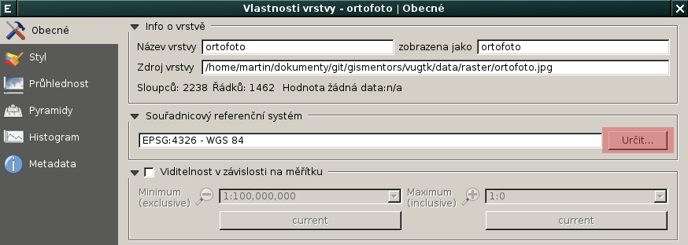

Načtení rastrových dat ve formátu JPEG a nastavení souřadnicového systému
-------------------------------------------------------------------------

.. note:: Rastrová data ve formátu :wikipedia-en:`JPEG` jsou
          umístěna v adresáři ``data/jpeg`` `zip archivu
          <https://github.com/GISMentors/vugtk/archive/master.zip>`_
          workshopu.

Rastrová data (v našem případě data ortofoto ve formátu JPEG) je
možné načíst z *menu*

.. figure:: qgis-add-raster-menu.png
           :width: 300px

anebo z *nástrojové lišty* aplikace QGIS.

.. figure:: qgis-add-raster-toolbar.png
           :width: 180px

Nakonec zvolíme soubor, který chceme načíst do QGISu jako novou rastrovou vrstvu.

Data obsahují přidružený soubor ve formátu :wikipedia-en:`World file` (``jgw``). QGIS je tedy zobrazí jako georeferencovaná, nicméně chybí informace o souřadnicovém systému. Pokud není nastaveno jinak, tak QGIS předpokládá souřadnicový systém WGS-84 (:epsg:`4326`).

.. figure:: qgis-raster-srs-warning.png
            :width: 800px

Vzhledem k tomu, že jsou naše data georeferencována v souřadnicovém systému UTM
33N (:epsg:`32633`), je potřeba nastavení rastrové vrtsvy v QGISu
změnit.

.. figure:: qgis-raster-properties.png

V záložce dialogu *Obecné* v sekci *Souřadnicový referenční systém* přiřadíme rastrové vrstvě korektní informaci o souřadnicovém připojení.

V tomto dialogu vybereme souřadnicový systém UTM 33N.

QGIS narozdíl např. :wikipedia:`Esri ArcGIS` neprovádí transformaci
datových vrstev připojených v odlišných souřadnicových systémech
automaticky. Tuto možnost je nutno povolit a zároveň zvolit cílový
souřadnicový systém mapového okna. Poté již QGIS zobrazí datové vrstvy
"přes sebe", tj. transformavené do zvoleného souřadnicového
systému. Volbu automatické transformace povolíme v dialogu *Vlastnosti
projektu* dostupné z menu aplikace.

V dialogu nejprve povolíme "on-the-fly transformaci" :fignote:`(1)`,
poté zvolíme cílový souřadnicový systém mapového okna :fignote:`(2)` -
v našem případě S-JTSK (:epsg:`5514`) a nastavení potvrdíme
:fignote:`(3)`.

Nyní by se měla rastrová vrstva ortofoto již zobrazit natransformována
do souřadnicového systému S-JTSK.

