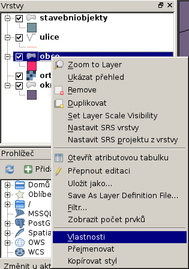
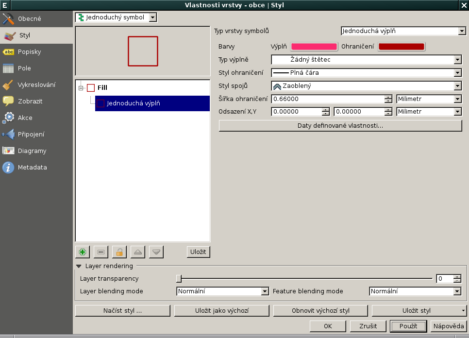
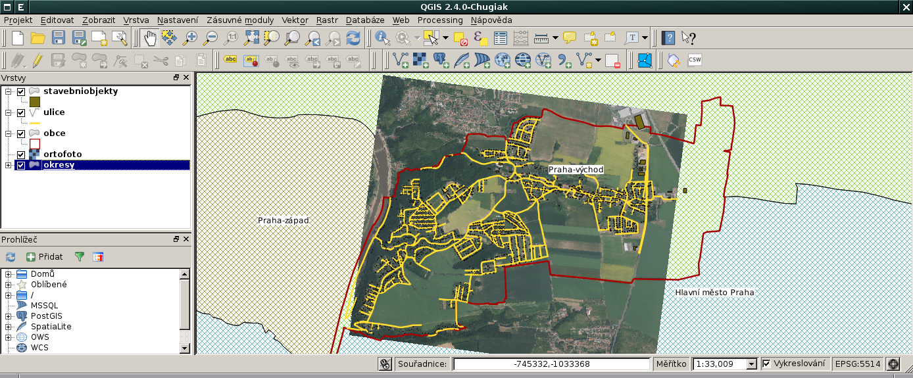

Nastavení symbologie
--------------------

Nastavit symbologii pro danou mapovou vrstvu lze z dialogu
:item:`Vlastnosti` dostupného z kontextového menu anebo dvojklikem nad danou
vrstvou.

QGIS umožňuje nastavit různé typy stylů od *jednoduchých* přes
*kategorizované* až po *odstupňované*. Podrobný popis nejrůznějších
nastavení, které QGIS v oblasti symbologie vrstev podporuje, je nad
rámec tohoto workshopu.

Nastavení symbologie pro vrstvu :map:`obce` může vypadat následovně:

A výsledek:

