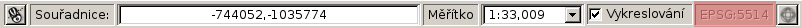

Načtení vektorových dat ve formátu Esri Shapefile
-------------------------------------------------

.. note:: Vektorová data ve formátu :wikipedia-en:`Esri Shapefile` jsou
          umístěna v adresáři ``data/shp`` `zip archivu
          <https://github.com/GISMentors/vugtk/archive/master.zip>`_
          workshopu.

Vektorová data (v našem případě data ve formátu Esri Shapefile) je
možné načíst z *menu*

.. figure:: qgis-add-vector-menu.png
           :width: 300px

anebo z *nástrojové lišty* aplikace QGIS.

.. figure:: qgis-add-vector-toolbar.png
           :width: 200px

V dialogu pro přidání vektorové vrstvy vybereme *soubor*
:fignote:`(1)`, který chceme přidat do QGISu jako novou vektorovou
vrstvu.

.. figure:: qgis-load-shapefile.png

            Přidání souboru `obce.shp` jako nové vektorové vrstvy

QGIS umožňuje přidat více vrstev najednou, tj. více souborů z daného
adresáře. V dialogu pro přidání vektorové vrstvy zvolíme *typ zdroje:
adresář* :fignote:`(1)` a poté zvolíme adresář :fignote:`(2)`, ze
kterého chceme soubory načíst.

.. figure:: qgis-load-shapefile-dir.png

            Načtení více souborů z daného adresáře

Posléze se objeví dialog, který umožňuje vybrat, jaké vektorové vrstvy
chceme do QGISu načíst. V našem případě vybereme všechny
:fignote:`(1)` vrstvy kromě *obce* (kterou jsme přidali již dříve).

            Výběr vektorových vrstev k načtení do QGISu

Výsledek může vypadat například takto (:doc:`symbologii mapových
vrstev <symbologie>` nastavíme později):

Souřadnicový systém načtených vektorových dat je uveden v pravém dolním rohu okna QGIS, v našem případě je to S-JTSK (:epsg:`5514`).

            
            Souřadnicový systém mapového okna
